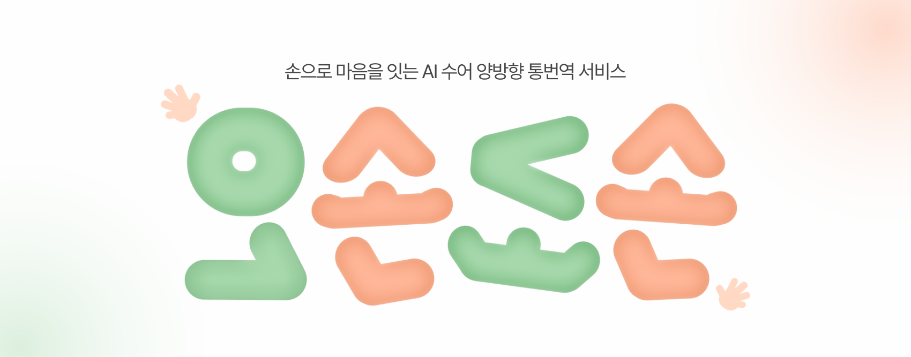
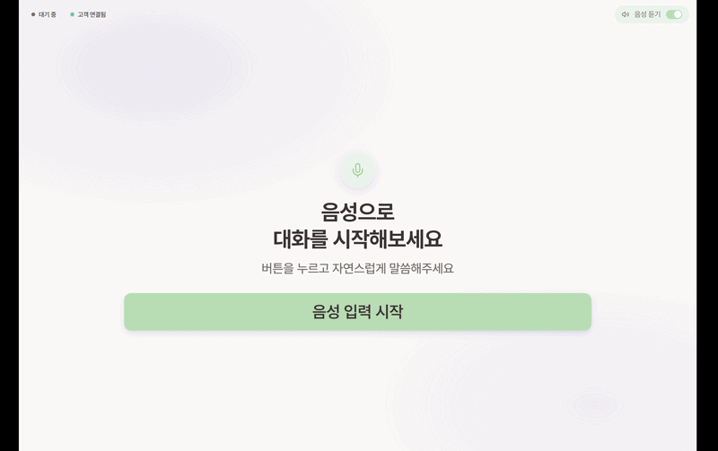
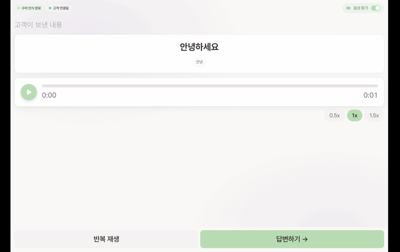
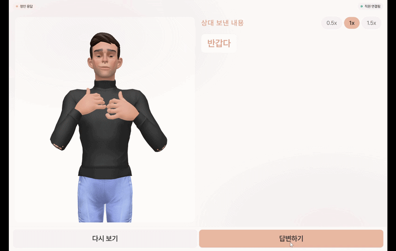
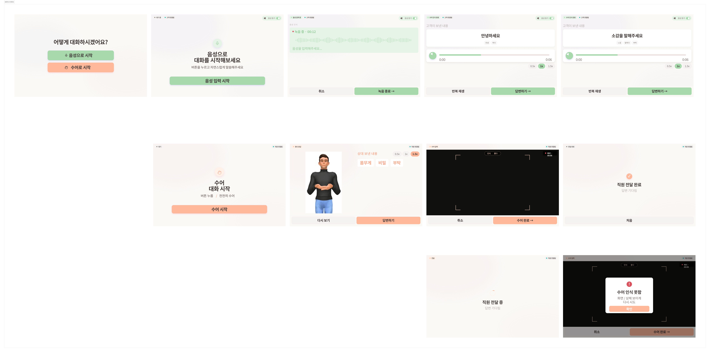
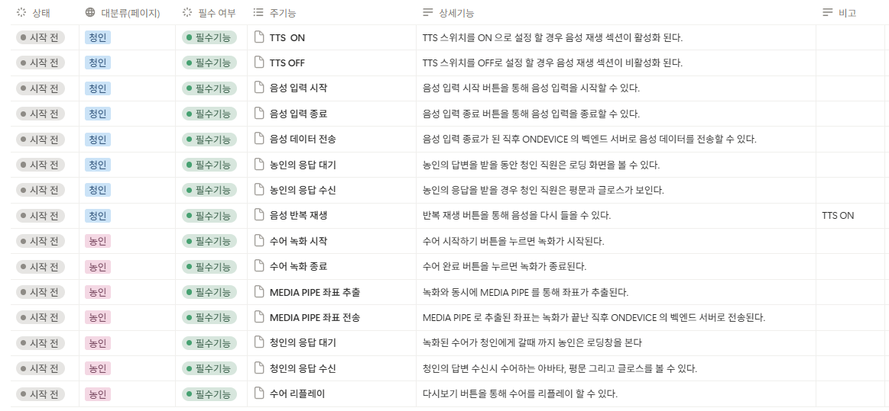
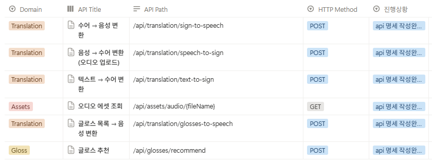

<div align="center">

# 오손도손



<br/>

**AI 수어 인식**과 **3D 아바타 렌더링 기술**을 결합하여,  
**농인의 수어와 청인의 음성을 실시간 대화로 연결하는 양방향 번역 서비스**입니다.

<br/>

<table width="80%">
  <tr>
    <td align="left">
      카메라로 입력한 수어는 <strong>MediaPipe 키포인트 추출</strong>과 <strong>seq2seq 번역</strong>을 거쳐 청인을 위한 <strong>음성·텍스트</strong>로 실시간 변환되고, 청인의 음성은 표정과 동작이 반영된 <strong>3D 아바타 수어</strong>로 실시간 변환되어 전달됩니다. 손의 움직임뿐 아니라 <strong>표정으로 전달되는 감정과 뉘앙스</strong>까지 함께 담아냅니다.
    </td>
  </tr>
</table>

<br/>

</div>

<div align="center">

 > **개발 기간** : 2026.04.06 ~ 2026.05.21 **(8주)**<br>
 **플랫폼** : Web · App · On-Device (Jetson Orin Nano)<br>
 **개발 인원** : 6명 <br>
 **주관** : 삼성 청년 SW 아카데미(SSAFY) 14기<br>

</div>

<br>

## 🔎 목차

<div align="center">

### <a href="#developers">🌟 팀원 구성</a>

### <a href="#techStack">🛠️ 기술 스택</a>

### <a href="#systemArchitecture">🌐 시스템 아키텍처</a>

### <a href="#skills">📲 기능 구성</a>

### <a href="#feature">🏛️ 기능 시연</a>

### <a href="#directories">📂 디렉터리 구조</a>

### <a href="#projectDeliverables">📦 프로젝트 산출물</a>

</div>
<br>

## 🌟 팀원 구성

<a name="developers"></a>

<!-- [TODO] 팀원 사진/이름/역할/GitHub URL/기여 내용은 팀원 확인 후 채우기 -->

<div align="center">

<table width="100%">
    <tr>
        <td width="25%" align="center">
            <a href="#">
                
            </a>
            <hr>
            <a href="#">
                <b>[팀원 이름]</b><br>([담당 역할])
            </a>
        </td>
        <td width="25%" align="center">
            <a href="#">
                
            </a>
            <hr>
            <a href="#">
                <b>[팀원 이름]</b><br>([담당 역할])
            </a>
        </td>
        <!-- 인원수에 맞춰 <td> 추가/삭제 -->
    </tr>
    <tr>
        <td width="25%" valign="top">
            <sub>
                - [담당 업무 ①]<br>
                - [담당 업무 ②]<br>
            </sub>
        </td>
        <td width="25%" valign="top">
            <sub>
                - [담당 업무 ①]<br>
                - [담당 업무 ②]<br>
            </sub>
        </td>
    </tr>
</table>

</div>
<br>

## 🛠️ 기술 스택

<a name="techStack"></a>

### 🌕 Frontend (Web)

<div align="center">


<br>

|  **Category**  | **Stack**                                                                               |
| :------------: | :-------------------------------------------------------------------------------------- |
|  **Language**  | TypeScript 5.9                                                                          |
| **Framework**  | React 19, React Router DOM 7                                                            |
|  **Library**   | Three.js (3D 아바타), @mediapipe/tasks-vision, Tailwind CSS 4, lucide-react, Pretendard |
| **Build Tool** | Vite 8                                                                                  |
|    **IDE**     | VS Code                                                                                 |

</div>

### 📱 Frontend (Mobile)

<div align="center">


<br>

|  **Category**  | **Stack**                                                                                                              |
| :------------: | :--------------------------------------------------------------------------------------------------------------------- |
|  **Language**  | TypeScript 5.9                                                                                                         |
| **Framework**  | React Native 0.81, Expo 54                                                                                             |
| **Navigation** | React Navigation 7 (Native Stack / Drawer)                                                                             |
|  **Library**   | react-native-vision-camera, react-native-mediapipe, three / expo-three / expo-gl, expo-audio, expo-video, expo-haptics |
| **Build Tool** | EAS Build (Expo)                                                                                                       |
|    **IDE**     | VS Code                                                                                                                |

</div>

### 🌑 Backend

<div align="center">


<br>

|  **Category**  | **Stack**                                             |
| :------------: | :---------------------------------------------------- |
|  **Language**  | Java 17                                               |
| **Framework**  | Spring Boot 3.5                                       |
|  **Library**   | Lombok, springdoc-openapi (Swagger UI), commons-lang3 |
| **Build Tool** | Gradle                                                |
|  **Database**  | MongoDB                                               |
|    **IDE**     | IntelliJ IDEA                                         |

</div>

### 🤖 AI

<div align="center">


<br>

|  **Category**  | **Stack**                                                                     |
| :------------: | :---------------------------------------------------------------------------- |
|  **Language**  | Python                                                                        |
| **Framework**  | FastAPI (Uvicorn)                                                             |
|  **Library**   | PyTorch, Transformers, sentence-transformers, MediaPipe, ffmpeg-python        |
|   **Model**    | OpenAI Whisper (STT), T5 seq2seq (자연어 ↔ 글로스 번역), gTTS / pyttsx3 (TTS) |
| **Deployment** | RunPod (GPU 추론 서버), Jetson (온디바이스 추론)                              |
|    **IDE**     | VS Code / PyCharm                                                             |

</div>

### ⚙️ DevOps

<div align="center">


<br>

#### 서버 스펙

| **환경** | **CPU** | **RAM** | **Storage** | **GPU** | **용도** |
| :---: | :---: | :---: | :---: | :---: | :--- |
| AWS EC2 (xlarge) | 4 vCPU | 16 GB | 320 GB SSD | — | Spring·Nginx·CI/CD 운영 서버 |
| RunPod | <!--TODO--> | <!--TODO--> | <!--TODO--> | <!--TODO GPU--> | AI GPU 추론 서버 |
| Jetson Orin Nano | 6코어 Arm® Cortex®-A78AE | 8 GB | 외장 SD 카드 | 1024개 코어 Ampere (내장) | 온디바이스 추론 |

<br>

#### 사용 기술

| **기술** | **용도**                                     |
| :------: | :------------------------------------------- |
| AWS EC2  | 운영 서버 호스팅                             |
|  Docker  | 컨테이너 기반 배포                           |
| Jenkins  | CI/CD 자동 배포 (release 브랜치 push 트리거) |
|  Nginx   | 리버스 프록시                                |

</div>

<br>

## 📲 기능 구성

<a name="skills"></a>

### 🎨 주요 기능

#### 1️⃣ 청인 → 농인 (음성 → 수어)

- **음성 인식**: 청인의 음성을 Whisper STT로 텍스트화
- **수어 번역**: 자연어를 수어 글로스로 변환 (seq2seq)
- **3D 아바타 재생**: 변환된 수어를 3D 아바타 모션으로 재생

#### 2️⃣ 농인 → 청인 (수어 → 음성)

- **수어 입력**: 카메라 + MediaPipe로 손·얼굴 keypoint 추출
- **자연어 변환**: 수어 글로스를 자연어 문장으로 변환
- **음성 출력**: 변환된 문장을 TTS로 음성 재생

#### 3️⃣ 글로스 추천 (모바일)

- **글로스 추천**: 카테고리별 자주 쓰는 표현을 빠르게 선택해 음성으로 출력

## 🏛️ 기능 시연

<a name="feature"></a>

### 🖥️ 화면 구성 및 기능

<!-- 아래 이미지는 readme-assets/ 의 데모 캡쳐입니다. -->

<div align="center">

<table>
  <tr>
    <td align="center" width="33%"><b>1. 시작 화면 (역할 선택)</b></td>
    <td align="center" width="33%"><b>2. 청인 대기 화면</b></td>
    <td align="center" width="33%"><b>3. 농인 대기 화면</b></td>
  </tr>
  <tr>
    <td align="center"></td>
    <td align="center"></td>
    <td align="center"></td>
  </tr>
</table>

</div>

### 🖥️ 실제 기능 시연

<div align="center">

<table>
  <tr>
    <td align="center" width="33%"><b>1. 농인 수어 입력</b></td>
    <td align="center" width="33%"><b>2. 청인 수어 내용 수신</b></td>
    <td align="center" width="33%"><b>3. 청인 음성 응답</b></td>
  </tr>
  <tr>
    <td align="center"></td>
    <td align="center"></td>
    <td align="center"></td>
  </tr>
  <tr>
    <td align="center" width="33%"><b>4. 농인 응답 수신</b></td>
    <td align="center" width="33%"><b>5. 모바일 - 글로스 추천</b></td>
    <td align="center" width="33%"><b>6. 모바일 - 음성 출력</b></td>
  </tr>
  <tr>
    <td align="center"></td>
    <td align="center"></td>
    <td align="center"></td>
  </tr>
</table>

</div>

## 📂 디렉터리 구조

<a name="directories"></a>

### 🌕 Frontend (Web)

<details align="left">
  <summary>
    <strong>Web 프로젝트 구조</strong>
  </summary>

```
📦frontend/web/src
 ├── app/             # 앱 진입/라우팅 구성
 ├── pages/           # 페이지 단위 컴포넌트 (청인/농인 등)
 ├── components/      # 공용 UI 컴포넌트
 ├── lib/             # 아바타 렌더러 등 핵심 라이브러리
 ├── hooks/           # 커스텀 훅
 ├── contexts/        # 전역 상태 (Context)
 ├── constants/       # 상수
 ├── types/           # 타입 정의
 ├── utils/           # 유틸 함수
 ├── styles/          # 전역 스타일
 └── assets/          # 정적 리소스
```

</details>

### 📱 Frontend (Mobile)

<details align="left">
  <summary>
    <strong>Mobile 프로젝트 구조</strong>
  </summary>

```
📦android/frontend/src
 ├── screens/         # 화면 단위 컴포넌트
 ├── navigation/      # React Navigation 구성
 ├── features/        # 기능 단위 모듈
 ├── components/      # 공용 UI 컴포넌트
 ├── lib/             # 아바타 렌더러 / MediaPipe 등
 ├── hooks/           # 커스텀 훅
 ├── contexts/        # 전역 상태 (Context)
 ├── constants/       # 상수
 └── types/           # 타입 정의
```

</details>

### 🌑 Backend

<details align="left">
  <summary>
    <strong>Backend 프로젝트 구조</strong>
  </summary>

```
📦backend/src/main/java/com/ssafy/backend
 ├── domain/
 │    ├── gloss/         # 글로스 추천 도메인
 │    ├── translation/   # 수어 ↔ 음성 번역 도메인
 │    └── onehandsign/   # 한손 수어 도메인
 └── global/
      ├── client/        # FastAPI 등 외부 연동 클라이언트
      ├── config/        # 설정
      ├── exception/     # 예외 처리
      └── response/      # 공통 응답 포맷
```

</details>

### 🤖 AI

<details align="left">
  <summary>
    <strong>AI 프로젝트 구조</strong>
  </summary>

```
📦fastapi
 ├── app/
 │    ├── api/routers/   # speech-to-sign, sign-to-speech, translation 등 라우터
 │    ├── services/      # 추론 서비스
 │    └── static/        # 정적 리소스
 ├── core/               # 공통 추론 코드 (T5 seq2seq 등)
 ├── runtime/            # 런타임 호환 레이어
 ├── poc/seq2seq/        # 데이터셋 빌더 / 학습 / 평가
 ├── data/               # 체크포인트, word clips, 산출물
 ├── deploy/runpod/      # RunPod 배포용 Dockerfile
 └── tests/              # 단위 / API 테스트
```

</details>

### 🧊 3D (아바타 / 키포인트)

<details align="left">
  <summary>
    <strong>3D 프로젝트 구조</strong>
  </summary>

```
📦3D
 ├── viewer/             # 3D 아바타 뷰어 (Three.js + Vite)
 ├── keypoint-converter/ # keypoint 포맷 변환
 ├── sign_interpolator/  # 수어 모션 보간
 ├── hand_lifting/       # 손 keypoint 2D → 3D lifting
 └── viewer_past/        # 이전 버전 뷰어 (참고용)
```

</details>

### 🖥️ Jetson (온디바이스)

<details align="left">
  <summary>
    <strong>Jetson 프로젝트 구조</strong>
  </summary>

```
📦jetson
 ├── frontend/           # 온디바이스 웹 UI (React + Vite)
 ├── backend/            # 온디바이스 FastAPI 서버
 └── AI/                 # 온디바이스 추론 코드
```

</details>

<br />

## 📦 프로젝트 산출물

<a name="projectDeliverables"></a>

<h3>🖼️ 화면 설계서</h3>

<details>
  <summary><strong>화면 설계서</strong></summary>
  <br>
  <div align="center">
    <h4>Web · On-Device (Jetson)</h4>
    
    <br><br>
    <h4>App (Mobile)</h4>
    
  </div>
</details>

<h3>📋 요구 사항 명세서</h3>
<details>
  <summary><strong>요구사항 명세서</strong></summary>
  <br>
  <div align="left">
    
  </div>
</details>

<h3>📡 API 명세서</h3>
<details>
  <summary><strong>API 명세서</strong></summary>
  <br>
  <div align="left">
    
  </div>
</details>

<br />

---

**© 2026 오손도손. All rights reserved.**

</div>
