# 시연 실행 가이드

이 문서는 발표 시연 순서에 따라 각 실행 환경에서 어떤 장면을 보여주고, 어디를 클릭하는지 정리한 가이드입니다.

현재는 WEB 섹션을 15개 캡쳐 이미지, MOBILE 섹션을 5개 캡쳐 이미지를 기준으로 작성했습니다. JETSON 섹션은 추후 내용을 추가할 수 있도록 제목만 남겨두었습니다.

## JETSON, WEB

### 실행 목적

WEB은 발표자가 눈으로 보여주는 SITE 화면입니다. 청인 화면(`/hearing`)과 농인 화면(`/signer`)을 동시에 연결한 뒤, 수어 입력, 자연어 전달, 음성 응답, 아바타 결과 수신까지의 대화 흐름을 보여줍니다.

### WEB 캡쳐 이미지 위치

이미지는 모두 아래 경로에 있습니다.

```text
C:\Users\SSAFY\Desktop\S14P31E104\exec\imges
```

### WEB 시연 전 준비

1. 프론트 개발 서버를 실행합니다.

```bash
npm run dev
```

2. 브라우저에서 `http://localhost:5173`에 접속합니다.
3. 실제 시연에서는 청인 화면과 농인 화면을 각각 별도 창 또는 탭으로 엽니다.
4. 청인 화면 상단에는 `고객 연결됨`, 농인 화면 상단에는 `직원 연결됨`이 표시되는지 확인합니다.
5. 수어 입력 화면의 카메라 영역은 발표 자료용 캡쳐에서 검은색으로 처리했습니다.

### 전체 실행 요약

| 단계 | 이미지 | 역할 화면 | 화면 상태 | 사용자 조작 |
| --- | --- | --- | --- | --- |
| 1 | `01-localhost-entry.png` | 시작 화면 | 역할 선택 | `수어로 시작`, `음성으로 시작` 중 역할 진입 |
| 2 | `02-hearing-idle.png` | 청인 | 대기 중 | 별도 조작 없음 |
| 3 | `03-signer-idle.png` | 농인 | 수어 시작 대기 | 하단 `수어 시작` 클릭 |
| 4 | `04-signer-signing-turn1.png` | 농인 | 수어 입력 중 | 하단 오른쪽 `수어 완료 →` 클릭 |
| 5 | `05-signer-waiting-turn1.png` | 농인 | 직원 전달 중 | 자동 대기 |
| 6 | `06-hearing-received-turn1.png` | 청인 | 수어 내용 수신 | 하단 오른쪽 `답변하기 →` 클릭 |
| 7 | `07-hearing-speaking-turn1.png` | 청인 | 음성 입력 중 | 하단 오른쪽 `녹음 종료 →` 클릭 |
| 8 | `08-hearing-waiting-turn1.png` | 청인 | 고객 전달 중 | 자동 대기 |
| 9 | `09-signer-received-turn1.png` | 농인 | 청인 응답 수신 | 하단 오른쪽 `답변하기` 클릭 |
| 10 | `10-signer-signing-turn2.png` | 농인 | 추가 수어 입력 중 | 하단 오른쪽 `수어 완료 →` 클릭 |
| 11 | `11-signer-waiting-turn2.png` | 농인 | 직원 전달 중 | 자동 대기 |
| 12 | `12-hearing-received-turn2.png` | 청인 | 추가 수어 내용 수신 | 하단 오른쪽 `답변하기 →` 클릭 |
| 13 | `13-hearing-speaking-turn2.png` | 청인 | 추가 음성 입력 중 | 하단 오른쪽 `녹음 종료 →` 클릭 |
| 14 | `14-hearing-waiting-turn2.png` | 청인 | 고객 전달 중 | 자동 대기 |
| 15 | `15-signer-received-turn2.png` | 농인 | 추가 청인 응답 수신 | 시연 종료 |

### 1. localhost 접속 화면

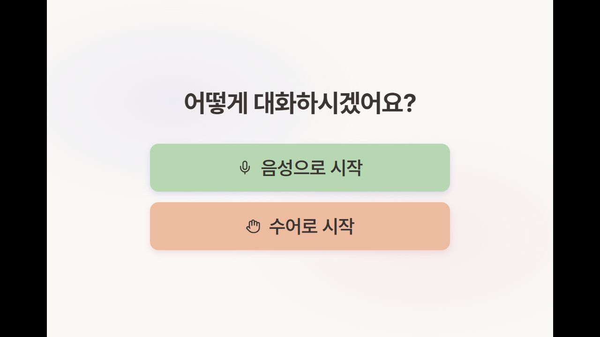

화면 목적은 사용자가 대화 시작 방식을 선택하는 것입니다. 중앙에 `어떻게 대화하시겠어요?` 문구가 보이고, 아래에 `음성으로 시작`, `수어로 시작` 두 버튼이 표시됩니다.

실행 설명:

1. 브라우저 주소창에 `http://localhost:5173`을 입력합니다.
2. 농인 역할 시연을 시작하려면 하단 두 버튼 중 `수어로 시작`을 클릭합니다.
3. 청인 역할 화면을 준비하려면 별도 탭 또는 창에서 `음성으로 시작`을 클릭합니다.
4. 발표에서는 이 화면을 서비스 진입점으로 설명하고, 이후 청인/농인 화면을 각각 열어 양방향 대화를 시연합니다.

클릭 위치:

1. `음성으로 시작`: 화면 중앙 아래의 초록색 버튼.
2. `수어로 시작`: `음성으로 시작` 바로 아래의 살구색 버튼.

### 2. 청인 대기 화면

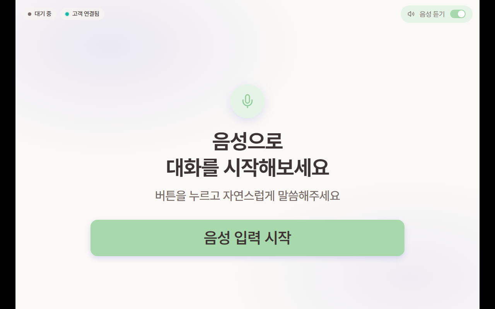

청인 역할의 기본 대기 화면입니다. 상단에는 현재 상태 `대기 중`, 상대 연결 상태 `고객 연결됨`, 우측에는 `음성 듣기` 토글이 보입니다. 중앙에는 `음성으로 대화를 시작해보세요` 안내와 `음성 입력 시작` 버튼이 표시됩니다.

실행 설명:

1. 청인 브라우저는 `/hearing` 화면에 진입합니다.
2. 농인 브라우저가 연결되면 상단에 `고객 연결됨` 상태가 표시됩니다.
3. 이 시점에는 아직 조작하지 않고, 농인이 먼저 수어를 입력하기를 기다립니다.
4. 청인은 농인 수어가 전달된 뒤 `고객이 보낸 내용` 화면으로 자동 전환됩니다.

클릭 위치:

1. 이 단계에서는 클릭하지 않습니다.
2. 만약 청인이 먼저 음성을 입력하는 흐름이라면 화면 하단 중앙의 `음성 입력 시작` 버튼을 클릭합니다.

### 3. 농인 대기 화면

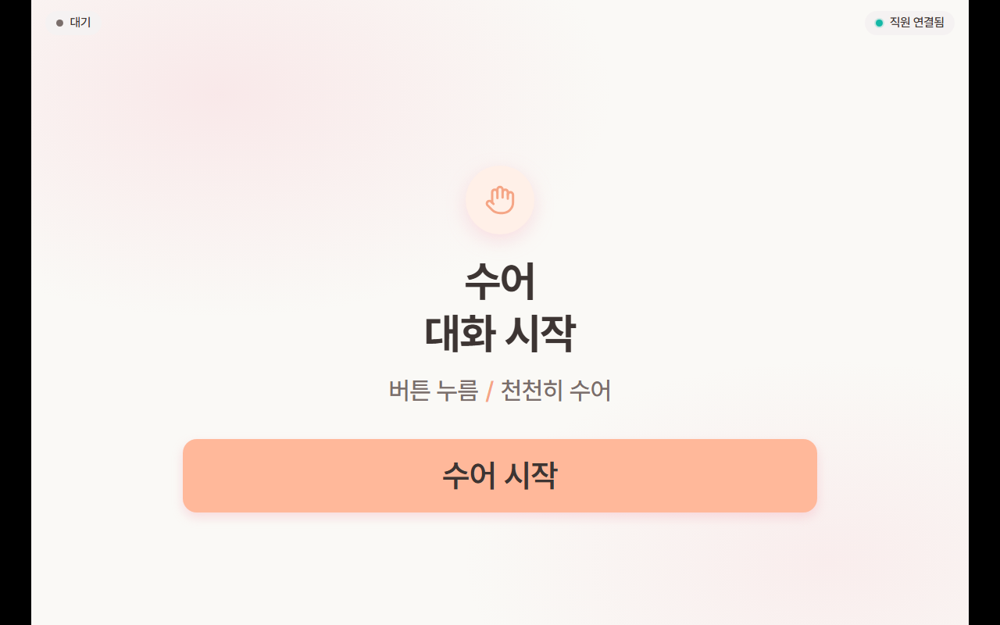

농인 역할의 기본 대기 화면입니다. 상단 좌측에는 `대기`, 우측에는 `직원 연결됨` 상태가 표시됩니다. 중앙에는 `수어 대화 시작` 안내가 나오고, 하단에는 `수어 시작` 버튼이 있습니다.

실행 설명:

1. 농인 브라우저는 `/signer` 화면에 진입합니다.
2. 상단 우측의 `직원 연결됨`을 확인합니다.
3. 발표자가 수어로 내용을 전달하는 장면으로 설명합니다.
4. 하단 중앙의 `수어 시작` 버튼을 클릭해 수어 입력 화면으로 이동합니다.

클릭 위치:

1. `수어 시작`: 화면 하단 중앙의 큰 살구색 버튼.

### 4. 농인 수어 입력 화면


농인이 수어를 입력하는 화면입니다. 발표 자료에서는 개인정보 또는 실제 사람 화면 노출을 막기 위해 카메라 영역을 검은색으로 처리했습니다. 상단에는 `수어 입력`, 우측에는 `직원 연결됨`이 표시됩니다.

실행 설명:

1. 농인은 카메라 앞에서 전달할 내용을 수어로 표현합니다.
2. 화면 중앙의 가이드 프레임 안에 상체와 손이 들어오도록 맞춥니다.
3. 실제 서비스에서는 손 인식 상태가 표시되고, REC가 시작되면 우측 상단에 녹화 시간이 보입니다.
4. 수어 표현이 끝나면 하단 오른쪽의 `수어 완료 →` 버튼을 클릭합니다.

클릭 위치:

1. `취소`: 하단 왼쪽 버튼. 수어 입력을 취소하고 이전 화면으로 돌아갑니다.
2. `수어 완료 →`: 하단 오른쪽 버튼. 현재까지 수집된 수어 프레임을 서버로 전송합니다.

### 5. 농인 수어 전달 대기 화면


농인이 수어 입력을 완료한 뒤, 직원에게 내용을 전달하고 답변을 기다리는 화면입니다. 중앙에 로딩 스피너와 `직원 전달 중`, `답변 기다림` 문구가 표시됩니다.

실행 설명:

1. `수어 완료 →` 클릭 후 자동으로 이 화면으로 전환됩니다.
2. 서버는 농인 수어 프레임을 받아 자연어 변환을 수행합니다.
3. 변환된 수어 내용이 청인 화면으로 전달됩니다.
4. 이 단계에서는 클릭하지 않고 자동 전환을 기다립니다.

클릭 위치:

1. 별도 클릭 없음.
2. 결과가 도착하면 청인 화면이 자동으로 내용 수신 화면으로 바뀝니다.

### 6. 청인 내용 수신 화면

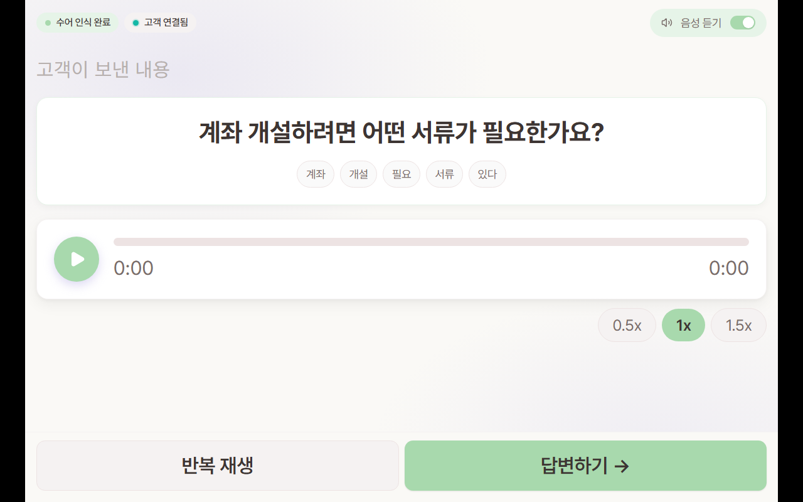

청인이 농인의 수어 내용을 자연어로 전달받은 화면입니다. `고객이 보낸 내용` 영역에는 변환된 문장이 표시되고, 아래에는 인식된 글로스가 pill 형태로 표시됩니다.

화면 확인 포인트:

1. 상단 상태가 `수어 인식 완료`로 바뀝니다.
2. 본문에는 수어 인식 결과로 변환된 자연어 문장이 표시됩니다.
3. 글로스 영역에는 인식된 핵심 단어들이 순서대로 표시됩니다.
4. 하단에는 `반복 재생`, `답변하기 →` 버튼이 있습니다.

실행 설명:

1. 청인은 전달된 문장을 확인합니다.
2. 청인은 전달받은 내용을 바탕으로 답변을 준비합니다.
3. 답변을 시작하기 위해 하단 오른쪽 `답변하기 →` 버튼을 클릭합니다.

클릭 위치:

1. `반복 재생`: 하단 왼쪽 버튼. TTS 또는 음성 재생을 다시 들을 때 사용합니다.
2. `답변하기 →`: 하단 오른쪽 버튼. 청인 음성 입력 화면으로 이동합니다.

### 7. 청인 음성 입력 화면

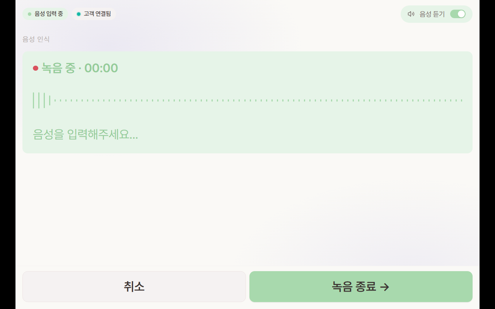

청인이 답변을 음성으로 입력하는 화면입니다. 중앙에는 `음성 인식` 영역, 녹음 상태, waveform UI, `음성을 입력해주세요...` 문구가 표시됩니다.

실행 설명:

1. 화면 진입과 동시에 녹음이 시작됩니다.
2. 청인은 마이크를 통해 답변 내용을 말합니다.
3. 음성 입력이 끝나면 하단 오른쪽 `녹음 종료 →` 버튼을 클릭합니다.
4. 클릭 후 음성 데이터가 서버로 전달됩니다.

클릭 위치:

1. `취소`: 하단 왼쪽 버튼. 음성 입력을 취소합니다.
2. `녹음 종료 →`: 하단 오른쪽 버튼. 청인 음성을 전송합니다.

### 8. 청인 음성 전달 대기 화면


청인의 음성 답변을 농인에게 전달하기 위해 수어 아바타 데이터로 변환하는 대기 화면입니다. 중앙에는 `고객에게 전달하고 있어요`, `수어 아바타로 변환하고 있어요...` 문구가 표시됩니다.

실행 설명:

1. `녹음 종료 →` 클릭 후 자동으로 이 화면으로 전환됩니다.
2. 서버는 청인 음성을 인식하고 수어 아바타 재생에 필요한 데이터로 변환합니다.
3. 이후 변환 결과를 농인 화면으로 전달합니다.
4. 이 단계에서는 클릭하지 않고 자동 전환을 기다립니다.

클릭 위치:

1. 별도 클릭 없음.
2. 결과가 도착하면 농인 화면이 청인 응답 수신 화면으로 바뀝니다.

### 9. 농인 결과 수신 화면

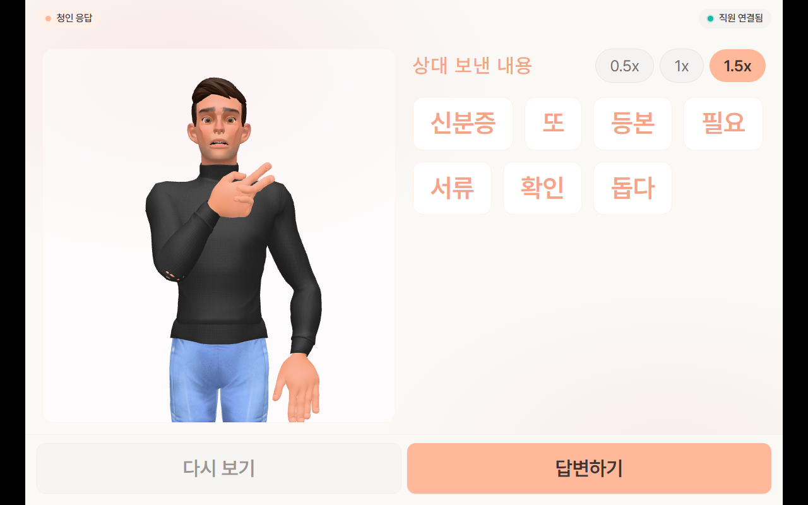

농인이 청인의 답변을 수어 아바타와 글로스로 전달받은 화면입니다. 좌측에는 아바타 재생 영역이 있고, 우측에는 `상대 보낸 내용`과 글로스 목록이 표시됩니다.

화면 확인 포인트:

1. 상단 상태가 `청인 응답`으로 바뀝니다.
2. 우측 글로스 영역에는 음성 답변을 바탕으로 변환된 핵심 단어들이 표시됩니다.
3. 우측 상단에는 재생 속도 선택 `0.5x`, `1x`, `1.5x`가 표시됩니다.
4. 하단에는 `다시 보기`, `답변하기` 버튼이 있습니다.

실행 설명:

1. 농인은 아바타와 글로스를 확인합니다.
2. 대화를 이어가기 위해 하단 오른쪽 `답변하기`를 클릭합니다.

클릭 위치:

1. `다시 보기`: 하단 왼쪽 버튼. 아바타 수어 재생을 다시 실행합니다.
2. `답변하기`: 하단 오른쪽 버튼. 농인 수어 입력 화면으로 이동합니다.

### 10. 농인 추가 수어 입력 화면

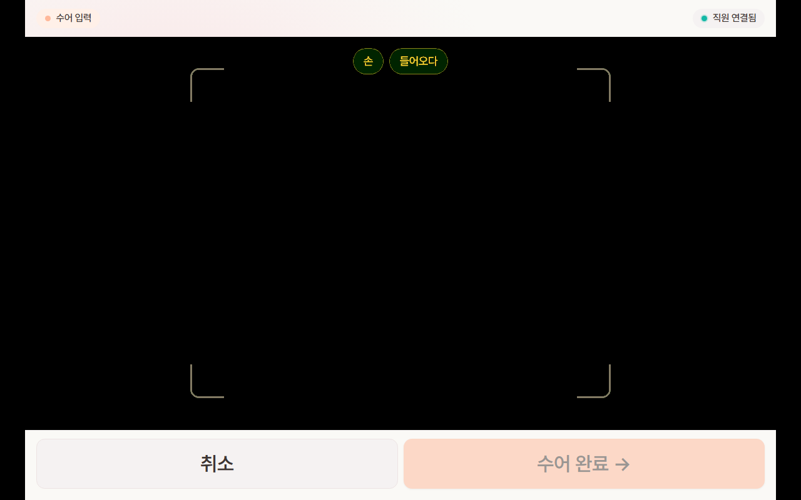

농인이 추가 내용을 수어로 입력하는 화면입니다. 앞선 수어 입력 화면과 동일하게 카메라 영역은 검은색으로 처리했습니다.

실행 설명:

1. 농인은 이어서 전달할 내용을 수어로 표현합니다.
2. 상단 `수어 입력`, 우측 `직원 연결됨` 상태를 확인합니다.
3. 수어 표현이 끝나면 하단 오른쪽 `수어 완료 →` 버튼을 클릭합니다.

클릭 위치:

1. `취소`: 하단 왼쪽 버튼.
2. `수어 완료 →`: 하단 오른쪽 버튼.

### 11. 농인 추가 수어 전달 대기 화면

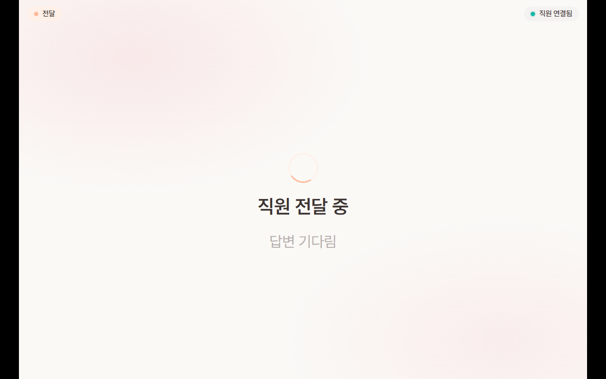

농인이 추가 수어 내용을 직원에게 전달하고 답변을 기다리는 화면입니다.

실행 설명:

1. `수어 완료 →` 클릭 후 자동 전환됩니다.
2. 서버는 추가 수어 내용을 자연어로 변환해 청인 화면으로 전달합니다.
3. 이 단계에서는 클릭하지 않고 청인 화면 전환을 기다립니다.

클릭 위치:

1. 별도 클릭 없음.

### 12. 청인 추가 내용 수신 화면

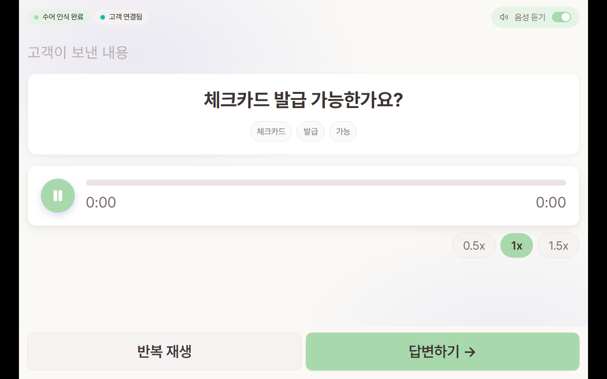

청인이 농인의 추가 수어 내용을 전달받은 화면입니다. 본문에는 변환된 자연어 문장이 표시됩니다.

화면 확인 포인트:

1. 상단 상태가 `수어 인식 완료`입니다.
2. 본문에는 수어 인식 결과로 변환된 자연어 문장이 표시됩니다.
3. 글로스 영역에는 인식된 핵심 단어들이 표시됩니다.
4. 하단 오른쪽에 `답변하기 →` 버튼이 있습니다.

실행 설명:

1. 청인은 질문을 확인합니다.
2. 청인은 전달받은 내용을 바탕으로 답변을 준비합니다.
3. 하단 오른쪽 `답변하기 →` 버튼을 클릭합니다.

클릭 위치:

1. `반복 재생`: 하단 왼쪽 버튼.
2. `답변하기 →`: 하단 오른쪽 버튼.

### 13. 청인 추가 음성 입력 화면

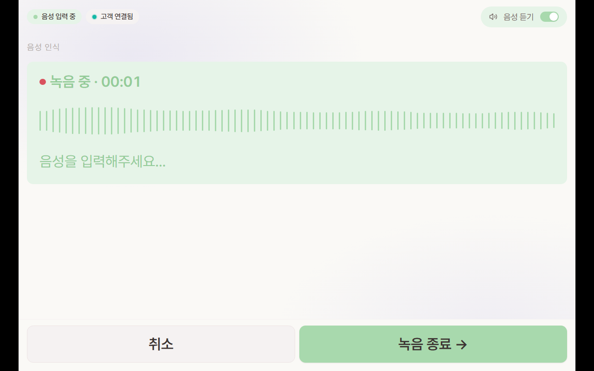

청인이 추가 답변을 음성으로 입력하는 화면입니다.

실행 설명:

1. 화면 진입과 동시에 녹음이 시작됩니다.
2. 청인은 마이크를 통해 답변 내용을 말합니다.
3. 음성 입력이 끝나면 하단 오른쪽 `녹음 종료 →` 버튼을 클릭합니다.

클릭 위치:

1. `취소`: 하단 왼쪽 버튼.
2. `녹음 종료 →`: 하단 오른쪽 버튼.

### 14. 청인 추가 음성 전달 대기 화면

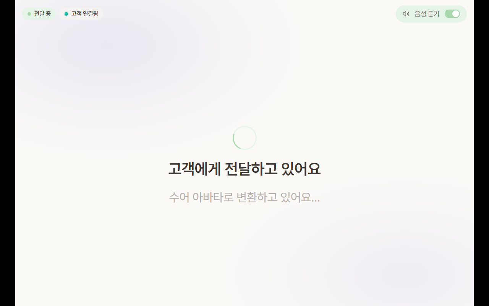

청인의 추가 답변을 농인에게 전달하기 위해 수어 아바타 데이터로 변환하는 대기 화면입니다.

실행 설명:

1. `녹음 종료 →` 클릭 후 자동 전환됩니다.
2. 서버는 청인 답변을 농인에게 전달할 수 있도록 수어 아바타 데이터로 변환합니다.
3. 수어 아바타 재생용 데이터가 생성되면 농인 화면으로 전달됩니다.
4. 이 단계에서는 클릭하지 않고 자동 전환을 기다립니다.

클릭 위치:

1. 별도 클릭 없음.

### 15. 농인 추가 결과 수신 화면

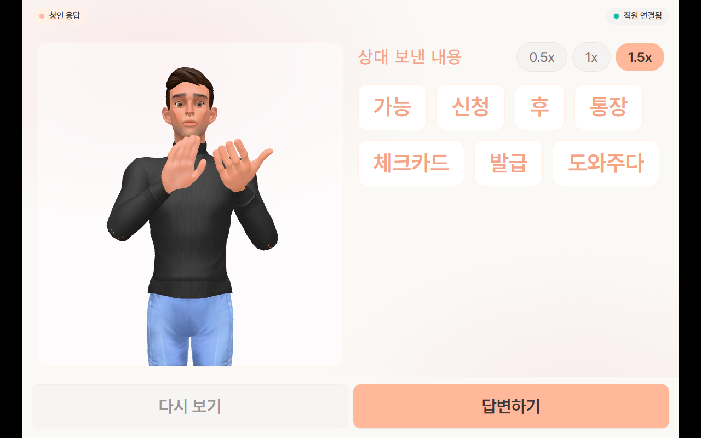

농인이 청인의 추가 답변을 수어 아바타와 글로스로 전달받은 화면입니다.

화면 확인 포인트:

1. 상단 상태가 `청인 응답`입니다.
2. 우측 글로스 영역에는 음성 답변을 바탕으로 변환된 핵심 단어들이 표시됩니다.
3. 하단에는 `다시 보기`, `답변하기` 버튼이 있습니다.
4. 필요하면 하단 버튼을 통해 아바타 재생을 반복하거나 대화를 이어갈 수 있습니다.

실행 설명:

1. 농인은 아바타 재생과 글로스 내용을 확인합니다.
2. 필요하면 `다시 보기`를 눌러 아바타 재생을 반복할 수 있습니다.
3. 발표 흐름에 맞춰 이 화면에서 WEB 시연을 마무리할 수 있습니다.

클릭 위치:

1. `다시 보기`: 하단 왼쪽 버튼.
2. `답변하기`: 하단 오른쪽 버튼. 추가 대화를 이어갈 때 사용합니다.

## MOBILE

### 실행 목적

MOBILE은 앱에서 추천 글로스를 선택하고, 선택된 글로스를 조합해 음성으로 들려주는 흐름을 보여주는 시연 화면입니다. 발표에서는 앱 시작 화면에서 추천 탭으로 이동한 뒤, 상황 카테고리와 글로스를 선택하면 다음 후보 글로스가 갱신되고, 마지막에 `음성 듣기` 버튼으로 선택 문장을 출력하는 과정을 보여줍니다.

### MOBILE 캡쳐 이미지 위치

이미지는 모두 아래 경로에 있습니다.

```text
C:\Users\SSAFY\Desktop\S14P31E104\exec\imges
```

### 전체 실행 요약

| 단계 | 이미지 | 화면 상태 | 사용자 조작 |
| --- | --- | --- | --- |
| 1 | `mobile-01-app-start.jpg` | 앱 시작 화면 | `수어로 대화` 또는 앱 진입 버튼 선택 |
| 2 | `mobile-02-menu-recommend.jpg` | 햄버거 메뉴 열림 | 메뉴에서 `추천` 탭 선택 |
| 3 | `mobile-03-recommend-category.jpg` | 추천 화면, `기타` 카테고리 선택 | 상황/고름에서 `기타` 선택 |
| 4 | `mobile-04-gloss-selected.jpg` | 글로스 선택 및 다음 후보 추천 | 원하는 글로스 pill 선택 |
| 5 | `mobile-05-voice-output.jpg` | 음성 출력 진행 | 하단 `음성 듣기` 버튼 클릭 |

### 1. 앱 시작 화면

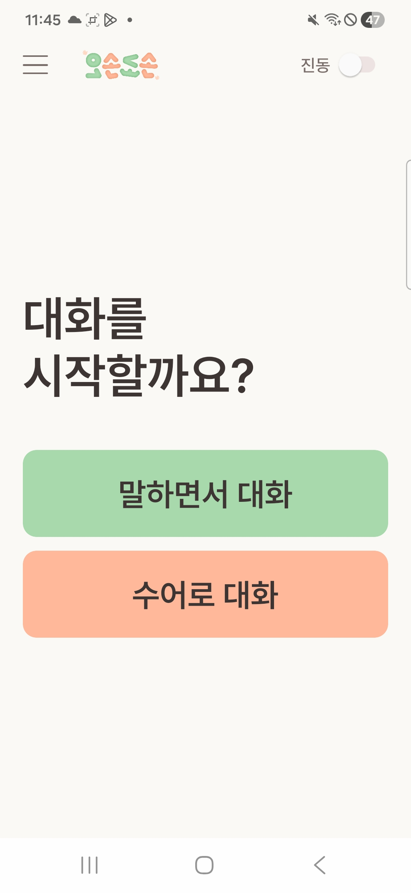

앱을 처음 실행했을 때 보이는 시작 화면입니다. 중앙에는 `대화를 시작할까요?` 문구가 표시되고, 아래에 `말하면서 대화`, `수어로 대화` 버튼이 있습니다.

실행 설명:

1. 모바일 앱을 실행합니다.
2. 시작 화면에서 대화 방식을 선택합니다.
3. 추천 글로스 기능을 보여주기 위해 앱 메인 화면으로 진입합니다.
4. 이후 상단 햄버거 메뉴를 열어 추천 화면으로 이동합니다.

클릭 위치:

1. `말하면서 대화`: 화면 중앙 아래의 초록색 버튼.
2. `수어로 대화`: `말하면서 대화` 아래의 살구색 버튼.

### 2. 햄버거 메뉴에서 추천 탭 선택

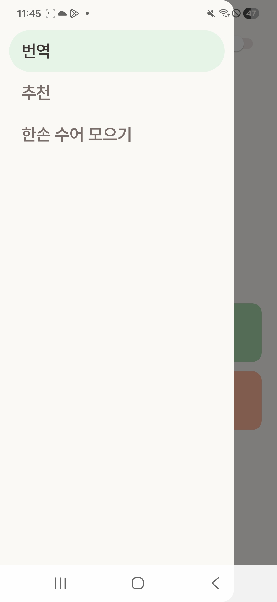

상단 햄버거 메뉴를 눌렀을 때 열리는 사이드 메뉴 화면입니다. 메뉴에는 `번역`, `추천`, `한손 수어 모으기` 항목이 보이며, 추천 기능 시연을 위해 `추천` 탭을 선택합니다.

실행 설명:

1. 앱 메인 화면 상단의 햄버거 메뉴 아이콘을 누릅니다.
2. 사이드 메뉴가 열리면 `추천` 항목을 확인합니다.
3. `추천`을 선택해 글로스 추천 화면으로 이동합니다.
4. 메뉴 바깥쪽 어두운 영역은 사이드 메뉴가 열린 상태를 보여줍니다.

클릭 위치:

1. 햄버거 메뉴: 앱 상단의 세 줄 아이콘.
2. `추천`: 사이드 메뉴 두 번째 항목.

### 3. 추천 화면에서 기타 카테고리 선택

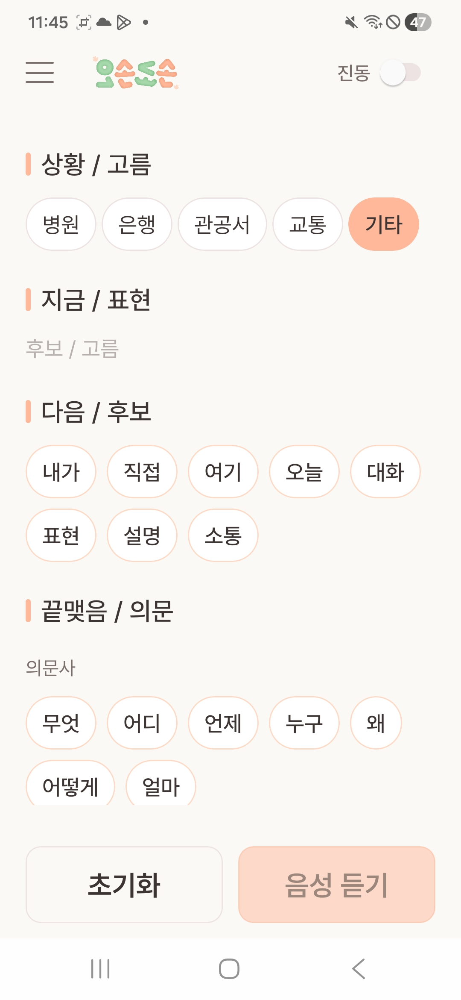

추천 탭으로 이동한 뒤 `상황 / 고름` 영역에서 `기타` 카테고리를 선택한 화면입니다. 상단에는 앱 로고와 진동 토글이 있고, 본문에는 `상황 / 고름`, `지금 / 표현`, `다음 / 후보`, `끝맺음 / 의문` 구역이 나뉘어 표시됩니다.

화면 확인 포인트:

1. `기타` 카테고리가 살구색으로 활성화되어 있습니다.
2. 아직 글로스를 선택하지 않은 상태라 `지금 / 표현`에는 선택 pill이 없습니다.
3. `다음 / 후보` 영역에는 `내가`, `직접`, `여기`, `오늘`, `대화`, `표현`, `설명`, `소통`이 후보로 표시됩니다.
4. 하단에는 `초기화`, `음성 듣기` 버튼이 있습니다.

실행 설명:

1. 추천 화면에서 `상황 / 고름` 영역을 확인합니다.
2. `병원`, `은행`, `관공서`, `교통`, `기타` 중 `기타`를 선택합니다.
3. 선택된 카테고리에 맞춰 사용할 수 있는 글로스 후보가 화면에 표시됩니다.
4. 다음 단계에서 원하는 글로스 pill을 눌러 현재 표현에 추가합니다.

클릭 위치:

1. `기타`: `상황 / 고름` 영역의 가장 오른쪽 살구색 pill.
2. 다음 후보 글로스: `다음 / 후보` 영역의 흰색 pill 버튼들.

### 4. 글로스 선택 및 다음 후보 추천

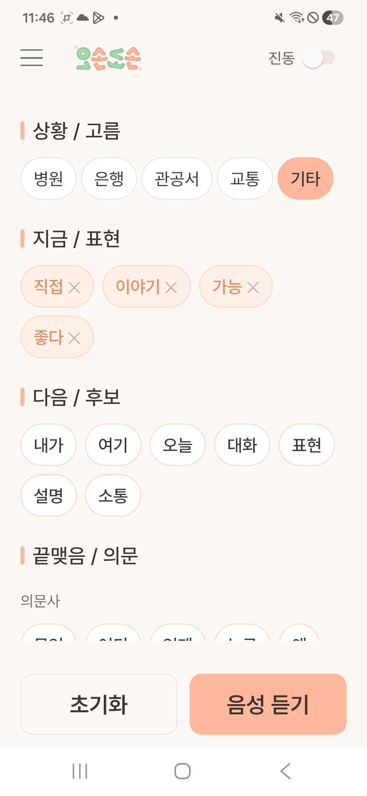

사용자가 글로스를 선택하면 `지금 / 표현` 영역에 선택한 글로스가 누적되고, 선택한 흐름에 맞춰 `다음 / 후보` 영역이 다시 추천되는 화면입니다.

화면 확인 포인트:

1. `지금 / 표현` 영역에 `직접`, `이야기`, `가능`, `좋다`가 선택되어 있습니다.
2. 각 선택 pill 오른쪽에는 삭제용 `X` 아이콘이 표시됩니다.
3. `다음 / 후보` 영역에는 다음에 이어 붙일 수 있는 후보 글로스가 표시됩니다.
4. 선택된 표현을 처음부터 다시 만들고 싶으면 하단 `초기화` 버튼을 사용할 수 있습니다.

실행 설명:

1. `다음 / 후보` 영역에서 원하는 글로스를 차례대로 선택합니다.
2. 선택한 글로스는 `지금 / 표현` 영역으로 이동합니다.
3. 글로스가 추가될 때마다 앱은 다음에 이어질 수 있는 후보 글로스를 다시 추천합니다.
4. 표현이 완성되면 하단 오른쪽의 `음성 듣기` 버튼을 누를 준비를 합니다.

클릭 위치:

1. 글로스 pill: `다음 / 후보` 영역의 각 단어 버튼.
2. 삭제 `X`: `지금 / 표현` 영역의 선택된 pill 오른쪽.
3. `초기화`: 하단 왼쪽 버튼.
4. `음성 듣기`: 하단 오른쪽 살구색 버튼.

### 5. 음성 듣기 버튼 클릭 및 음성 출력

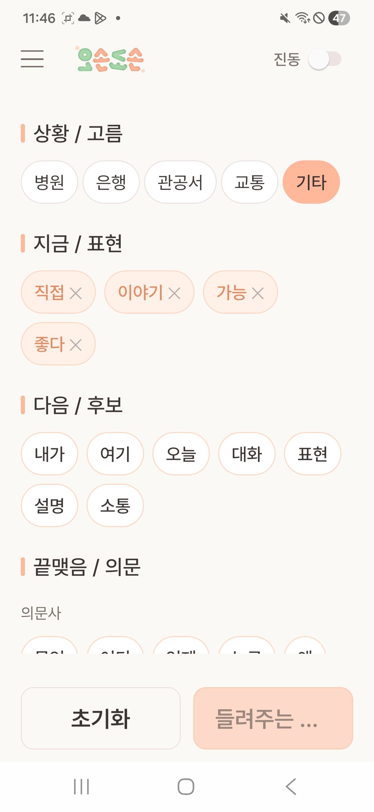

선택된 글로스를 음성으로 출력하는 단계입니다. 하단 오른쪽 버튼이 `들려주는 ...` 상태로 바뀌어 현재 음성이 재생 중임을 보여줍니다.

화면 확인 포인트:

1. `지금 / 표현` 영역에는 선택된 글로스가 그대로 유지됩니다.
2. 하단 오른쪽 버튼은 `음성 듣기`에서 `들려주는 ...` 상태로 변경됩니다.
3. 음성 출력 중에는 버튼 색상이 연하게 표시되어 재생 중 상태를 알 수 있습니다.
4. 음성 출력이 끝나면 다시 `음성 듣기` 버튼으로 돌아가 반복 재생할 수 있습니다.

실행 설명:

1. 선택한 글로스 조합을 확인합니다.
2. 하단 오른쪽 `음성 듣기` 버튼을 클릭합니다.
3. 앱이 선택된 글로스 조합을 자연스러운 음성으로 출력합니다.
4. 발표에서는 이 단계에서 추천 글로스가 실제 음성으로 전달되는 결과를 설명합니다.

클릭 위치:

1. `음성 듣기`: 하단 오른쪽 살구색 버튼.
2. `초기화`: 하단 왼쪽 버튼. 다음 시연을 위해 선택한 글로스를 모두 비울 때 사용합니다.
